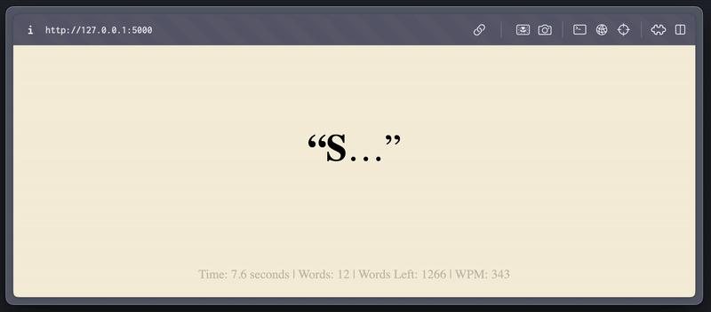

# Fast + Focused 



The Fast + Focused App is a web-based application designed to enhance your reading speed by displaying words from a text file at a rapid pace. This method, often referred to as speed reading, allows users to consume content faster by minimizing the eye movement and focusing on central vision. The app dynamically reads a text file and displays each word individually at a user-defined speed.

## Setup

The app will be running on http://localhost:5000. Open this URL in your web browser to access the app.

```bash
pip install Flask
```

```bash
python app.py
```

## Usage

To use the app, simply follow these steps:

1. Make sure you have a text file named `sucveceza.txt` in the same directory as `app.py`. This file should contain the text you want to read fast.
2. Start the application using the instructions provided in the **Setup** section.
3. Open your browser and go to http://localhost:5000.
4. Click the "Start" button to begin the speed reading session.

## Customization

You can customize the reading speed by modifying the `speed` variable in the `index.html` file. The speed is defined in milliseconds per word. The default is set to 175 milliseconds per word.

## Contributing

We welcome contributions to this project! If you have suggestions for improvements or encounter any issues, please feel free to submit an issue or pull request.

## License

This project is licensed under the MIT License - see the LICENSE file for details.